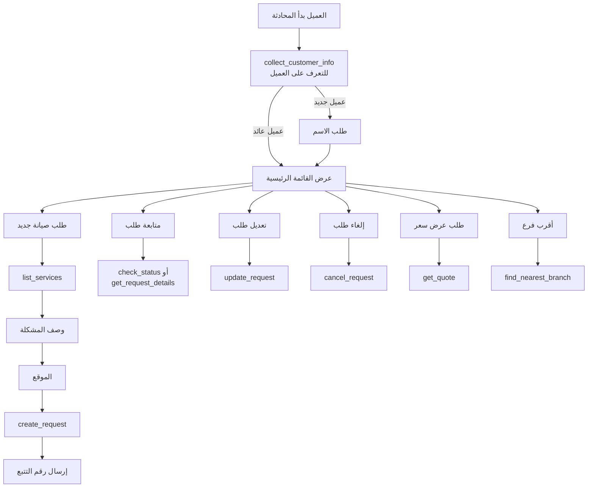

# 🤖 UberFix Bot Gateway — دليل الدمج الشامل

> **المرجع الوحيد** لربط أي بوت أو موقع تابع لمؤسسة العزب بنظام UberFix.
> آخر تحديث: 2026-04-22 — الإصدار v3.

---

## 1. نظرة عامة

`bot-gateway` هي **نقطة الدخول الموحدة** لجميع البوتات والمواقع الخارجية للتعامل مع نظام طلبات الصيانة في UberFix.

تم تصميمها لتعمل عبر **عزبوت** وأي موقع آخر تابع لمؤسسة العزب (عقارات / صيانة / تجارة) من خلال:

- ✅ مفاتيح API منفصلة لكل موقع (`api_consumers`)
- ✅ Rate limiting لكل مستهلك
- ✅ تسجيل كامل لكل الطلبات (`api_gateway_logs` + `audit_logs`)
- ✅ سياق جلسات (`bot_sessions`) لمتابعة المحادثة
- ✅ توجيه آلي عبر `maintenance-gateway` لضمان توحيد البنية

```
┌──────────────────┐     ┌─────────────────┐     ┌──────────────────────┐
│  AzaBot / موقع  │ ──▶ │   bot-gateway    │ ──▶ │  maintenance-gateway │
│   عقارات العزب   │     │  (هذه الوثيقة)   │     │  (canonical layer)   │
└──────────────────┘     └─────────────────┘     └──────────────────────┘
                                  │                          │
                                  ▼                          ▼
                          ┌───────────────┐         ┌──────────────────┐
                          │ assign-tech   │         │ outbound_messages│
                          │ to-request    │         │  + WhatsApp      │
                          └───────────────┘         └──────────────────┘
```

---

## 2. عنوان الـ Endpoint

```
POST https://zrrffsjbfkphridqyais.supabase.co/functions/v1/bot-gateway
```

### المصادقة (اختر طريقة واحدة)

| الحالة | الهيدر المطلوب |
|---|---|
| **بوت داخلي / ويدجت موقع UberFix** | `Authorization: Bearer <ANON_KEY>` |
| **موقع خارجي تابع لمؤسسة العزب** | `x-api-key: <مفتاح API مخصص>` |
| **استدعاء داخلي من edge function** | `Authorization: Bearer <SERVICE_ROLE_KEY>` |

> 🔑 لإصدار مفتاح API لموقع جديد: أضف صفاً في جدول `api_consumers` (channel='api') مع `is_active=true` و `rate_limit_per_minute` المناسب.

---

## 3. شكل الطلب الموحد

```jsonc
POST /functions/v1/bot-gateway
Content-Type: application/json
x-api-key: <YOUR_KEY>

{
  "action": "create_request",       // اسم العملية - راجع القسم 4
  "payload": { /* بيانات العملية */ },
  "session_id": "user-uuid-or-phone", // اختياري - لتتبع سياق المحادثة
  "metadata": {
    "source": "azab_real_estate",   // اسم الموقع الذي أرسل الطلب
    "locale": "ar"
  }
}
```

### شكل الاستجابة الموحد

```jsonc
{
  "success": true,
  "data": { /* النتيجة */ },
  "message": "رسالة للعرض على المستخدم",
  "request_id": "uuid",             // عند إنشاء طلب
  "tracking_number": "MR-26-00045"  // عند إنشاء طلب
}
```

عند الفشل:
```jsonc
{ "success": false, "error": "وصف الخطأ بالعربية" }
```

---

## 4. كل الـ Actions المدعومة

### 4.1 `create_request` — إنشاء طلب صيانة

```jsonc
{
  "action": "create_request",
  "payload": {
    "client_name": "أحمد محمد",
    "client_phone": "+201001234567",
    "client_email": "ahmed@example.com",  // اختياري
    "location": "المعادي - شارع 9 - عمارة 5",
    "service_type": "plumbing",            // raجع 4.10
    "title": "تسريب مياه في الحمام",
    "description": "تسريب من ماسورة الحوض منذ يومين",
    "priority": "high",                    // low | medium | high
    "latitude": 29.9602,                   // اختياري
    "longitude": 31.2569
  },
  "session_id": "wa_201001234567"
}
```

**ماذا يحدث خلف الكواليس؟**
1. التحقق من الحقول المطلوبة + تطهير المدخلات
2. توجيه عبر `maintenance-gateway` لإنشاء الطلب canonically
3. توليد `request_number` تلقائي (مثل `MR-26-00045`)
4. إرسال إشعار WhatsApp تلقائي للعميل (عبر `send-whatsapp-meta`)
5. تسجيل في `audit_logs` و `api_gateway_logs`

**الاستجابة:**
```jsonc
{
  "success": true,
  "request_id": "550e8400-e29b-41d4-a716-446655440000",
  "tracking_number": "MR-26-00045",
  "message": "تم إنشاء الطلب بنجاح. رقم التتبع: MR-26-00045"
}
```

---

### 4.2 `check_status` — البحث في الطلبات

```jsonc
{
  "action": "check_status",
  "payload": {
    "search_term": "MR-26-00045",
    "search_type": "request_number"   // request_number | phone | name
  }
}
```

> يرجع آخر 5 طلبات مطابقة فقط.

---

### 4.3 `get_request_details` — تفاصيل طلب واحد

```jsonc
{
  "action": "get_request_details",
  "payload": {
    "request_number": "MR-26-00045",  // أو request_id
    "client_phone": "+201001234567"   // مهم: للحماية من التسريب
  }
}
```

> 🔒 إذا أُرسل `client_phone` يجب أن يطابق هاتف الطلب وإلا يُرفض الطلب.
> الاستجابة تشمل بيانات الفني المعيّن (إن وُجد).

---

### 4.4 `update_request` — تعديل طلب

```jsonc
{
  "action": "update_request",
  "payload": {
    "request_id": "uuid",
    "client_phone": "+201001234567",  // مهم للتحقق
    "updates": {
      "description": "نص محدث",
      "location": "موقع جديد",
      "priority": "high",
      "service_type": "electrical",
      "customer_notes": "ملاحظة من العميل",
      "latitude": 29.96,
      "longitude": 31.25,
      "title": "عنوان جديد",
      "workflow_stage": "on_hold"     // مسموح فقط: submitted, acknowledged, on_hold, cancelled, scheduled
    }
  }
}
```

**القيود:**
- البوت **لا يستطيع** نقل الطلب إلى `in_progress` أو `completed` أو `billed` أو `paid` أو `closed`
- لا يمكن تعديل طلب في حالة نهائية (`closed`, `paid`, `cancelled`)
- الحقول غير المسموحة تُتجاهل بصمت

---

### 4.5 `cancel_request` — إلغاء طلب

```jsonc
{
  "action": "cancel_request",
  "payload": {
    "request_id": "uuid",
    "client_phone": "+201001234567",
    "reason": "العميل لم يعد بحاجة للخدمة"
  }
}
```

> ❌ لا يمكن إلغاء طلب وصل لمرحلة `in_progress` أو ما بعدها.

---

### 4.6 `add_note` — إضافة ملاحظة عميل

```jsonc
{
  "action": "add_note",
  "payload": {
    "request_id": "uuid",
    "note": "نسيت أذكر أن السباك يجب يأتي قبل الظهر",
    "client_phone": "+201001234567"
  }
}
```

> الملاحظات تُلحَق بـ `customer_notes` بطابع زمني، لا تستبدل.

---

### 4.7 `assign_technician` — تعيين فني

**أ) تعيين تلقائي ذكي (موصى به):**

```jsonc
{
  "action": "assign_technician",
  "payload": {
    "request_id": "uuid",
    "auto": true
  }
}
```

> يستدعي `assign-technician-to-request` الذي يختار أفضل فني بناءً على:
> - المسافة (40%)
> - التقييم (30%)
> - المستوى - top_rated/platinum/gold/...  (15%)
> - مطابقة التخصص (10%)
> - عدد المراجعات (5%)

**ب) تعيين يدوي بـ ID:**

```jsonc
{
  "action": "assign_technician",
  "payload": {
    "request_id": "uuid",
    "technician_id": "tech-uuid"
  }
}
```

---

### 4.8 `list_technicians` — قائمة فنيين متاحين

```jsonc
{
  "action": "list_technicians",
  "payload": {
    "specialization": "plumbing",   // اختياري
    "city_id": "uuid",              // اختياري
    "limit": 10                     // افتراضي 10، الحد الأقصى 50
  }
}
```

> يرجع فقط فنيين `is_active=true AND is_verified=true` مرتبين حسب التقييم.

---

### 4.9 `list_categories` — فئات الصيانة من DB

```jsonc
{ "action": "list_categories", "payload": {} }
```

> يقرأ من `maintenance_categories`. إذا فاضي، يرجع قائمة `service_types` الافتراضية.

---

### 4.10 `list_services` — أنواع الخدمات الثابتة

```jsonc
{ "action": "list_services", "payload": {} }
```

**القيم المتاحة:**

| key | label |
|---|---|
| `plumbing` | سباكة |
| `electrical` | كهرباء |
| `ac` | تكييف |
| `painting` | دهانات |
| `carpentry` | نجارة |
| `cleaning` | تنظيف |
| `general` | صيانة عامة |
| `appliance` | أجهزة منزلية |
| `pest_control` | مكافحة حشرات |
| `landscaping` | حدائق وتنسيق |
| `finishing` | تشطيبات |
| `renovation` | ترميم |

---

### 4.11 `get_branches` — كل الفروع

```jsonc
{ "action": "get_branches", "payload": {} }
```

---

### 4.12 `find_nearest_branch` — أقرب فرع

```jsonc
{
  "action": "find_nearest_branch",
  "payload": {
    "latitude": 29.9602,
    "longitude": 31.2569,
    "city": "القاهرة"          // اختياري - فلترة أولية
  }
}
```

> يرجع أقرب 5 فروع مع `distance_km` لكل فرع.

---

### 4.13 `collect_customer_info` — جمع بيانات العميل

```jsonc
{
  "action": "collect_customer_info",
  "payload": {
    "client_phone": "+201001234567",   // إجباري
    "client_name": "أحمد محمد",
    "client_email": "ahmed@example.com",
    "location": "المعادي",
    "latitude": 29.96,
    "longitude": 31.25,
    "preferred_branch_id": "uuid",
    "notes": "يفضل الزيارة بعد العصر"
  },
  "session_id": "wa_201001234567"      // إجباري لحفظ السياق
}
```

**الاستجابة:**
```jsonc
{
  "success": true,
  "message": "تم حفظ بيانات العميل في السياق",
  "data": {
    "is_returning_customer": true,
    "previous_data": { /* بيانات آخر طلب */ },
    "collected": { /* البيانات الحالية */ }
  }
}
```

> 💡 استخدمها في **بداية المحادثة** للتعرف على العميل وتقليل الأسئلة المتكررة.

---

### 4.14 `get_quote` — طلب عرض سعر

```jsonc
{
  "action": "get_quote",
  "payload": {
    "service_type": "renovation",
    "description": "ترميم شقة 120م",
    "location": "المعادي",
    "area_sqm": 120,
    "client_name": "أحمد",
    "client_phone": "+201001234567"
  }
}
```

---

## 5. تدفق المحادثة الموصى به للبوت



---

## 6. الاستخدام من TypeScript / React

```typescript
import {
  createMaintenanceRequest,
  getRequestDetails,
  updateRequest,
  cancelRequest,
  assignTechnician,
  findNearestBranch,
  collectCustomerInfo,
} from "@/lib/bot-gateway";

// 1. التعرف على العميل
const ctx = await collectCustomerInfo(
  { client_phone: "+201001234567", client_name: "أحمد" },
  "session_wa_001"
);

// 2. إنشاء طلب
const created = await createMaintenanceRequest({
  client_name: "أحمد",
  client_phone: "+201001234567",
  location: "المعادي",
  title: "تسريب مياه",
  description: "تسريب في الحمام منذ يومين",
  service_type: "plumbing",
  priority: "high",
}, "session_wa_001");

if (created.success) {
  console.log("رقم التتبع:", created.tracking_number);

  // 3. تعيين فني تلقائي
  await assignTechnician({
    request_id: created.request_id!,
    auto: true,
  });
}
```

### من موقع خارجي بـ API Key

```typescript
const resp = await fetch(
  "https://zrrffsjbfkphridqyais.supabase.co/functions/v1/bot-gateway",
  {
    method: "POST",
    headers: {
      "Content-Type": "application/json",
      "x-api-key": "YOUR_API_KEY_FROM_api_consumers",
    },
    body: JSON.stringify({
      action: "create_request",
      payload: { /* ... */ },
      metadata: { source: "azab_real_estate" }
    }),
  }
);
```

---

## 7. الأمان والحدود

| البند | القيمة الافتراضية |
|---|---|
| Rate limit للمستخدم العام | 10 طلبات/دقيقة من نفس IP |
| Rate limit لـ API consumer | حسب `rate_limit_per_minute` في `api_consumers` |
| الحد الأقصى لحجم الملف | 5MB |
| الحد الأقصى للوصف | 500 حرف |
| الحد الأقصى للعنوان | 200 حرف |
| TTL للجلسات | 7 أيام |
| التحقق من العميل | عبر آخر 9 أرقام من رقم الهاتف |

### المراحل المسموحة للبوت
البوت **يستطيع** نقل الطلب إلى: `submitted`, `acknowledged`, `on_hold`, `cancelled`, `scheduled` فقط.
البوت **لا يستطيع** الانتقال إلى أي مرحلة تنفيذية أو مالية (`in_progress`, `completed`, `billed`, `paid`, `closed`).

---

## 8. إعداد موقع جديد لمؤسسة العزب

### الخطوة 1 — إصدار API Key

```sql
INSERT INTO public.api_consumers (
  name, channel, api_key, is_active,
  rate_limit_per_minute, allowed_origins,
  company_id, branch_id
) VALUES (
  'azab_real_estate',                         -- اسم الموقع
  'api',
  encode(gen_random_bytes(32), 'hex'),        -- مفتاح عشوائي 64 حرف
  true,
  60,                                          -- 60 طلب/دقيقة
  ARRAY['https://realestate.al-azab.com'],    -- النطاقات المسموحة
  'company-uuid',                              -- شركة افتراضية
  'branch-uuid'                                -- فرع افتراضي
);
```

### الخطوة 2 — استخدام المفتاح في كل طلب

```javascript
fetch(BOT_GATEWAY_URL, {
  method: "POST",
  headers: { "x-api-key": "<المفتاح_من_الخطوة_1>" },
  body: JSON.stringify({ action, payload, metadata: { source: "azab_real_estate" }})
});
```

### الخطوة 3 — مراقبة الاستخدام

```sql
-- آخر 100 طلب من موقع معين
SELECT route, status_code, duration_ms, created_at
FROM api_gateway_logs
WHERE consumer_id = (SELECT id FROM api_consumers WHERE name = 'azab_real_estate')
ORDER BY created_at DESC
LIMIT 100;
```

---

## 9. التشخيص (Troubleshooting)

| الخطأ | السبب | الحل |
|---|---|---|
| `401 Unauthorized` | لا يوجد مفتاح أو غير صالح | تحقق من `x-api-key` أو `Authorization` |
| `403 Origin not allowed` | النطاق غير في `allowed_origins` | أضف الـ Origin في `api_consumers` |
| `429 Rate limit` | تجاوز الحد | انتظر دقيقة أو زِد `rate_limit_per_minute` |
| `الطلب غير موجود` | request_id خاطئ | تحقق من رقم التتبع |
| `غير مصرح بتعديل هذا الطلب` | client_phone لا يطابق | تأكد من رقم العميل |
| `لا يمكن إلغاء طلب في حالة X` | الطلب تجاوز مرحلة الإلغاء | اتصل بالإدارة |

### قراءة اللوجز
- Edge Function logs: https://supabase.com/dashboard/project/zrrffsjbfkphridqyais/functions/bot-gateway/logs
- Gateway logs: `SELECT * FROM api_gateway_logs ORDER BY created_at DESC LIMIT 50;`
- Audit trail: `SELECT * FROM audit_logs WHERE action LIKE 'BOT_%' ORDER BY created_at DESC;`

---

## 10. الجداول المرتبطة

| الجدول | الدور |
|---|---|
| `api_consumers` | مفاتيح API لكل موقع/بوت خارجي |
| `api_gateway_logs` | سجل كامل لكل طلبات الـ gateway |
| `bot_sessions` | سياق محادثات البوت (TTL 7 أيام) |
| `audit_logs` | سجل تدقيق كل عمليات التعديل |
| `maintenance_requests` | الطلبات نفسها (canonical) |
| `outbound_messages` | قائمة انتظار رسائل واتساب الصادرة |

---

## 11. خريطة الـ Edge Functions المرتبطة

```
bot-gateway
   ├─▶ maintenance-gateway       (إنشاء الطلب canonically)
   │      └─▶ send-maintenance-notification
   │              ├─▶ send-whatsapp-meta
   │              └─▶ in-app notifications trigger
   ├─▶ assign-technician-to-request  (التعيين الذكي)
   │      └─▶ send-unified-notification (للفنيين)
   └─▶ send-whatsapp-meta        (تأكيد إنشاء الطلب للعميل)
```

---

## 12. خلاصة مفاتيح الالتزام

✅ **افعل**:
- استخدم `bot-gateway` لكل تفاعلات البوت — لا تستدعِ `maintenance_requests` مباشرة من الواجهة
- مرّر `session_id` ثابت لكل محادثة
- استخدم `client_phone` كأداة تحقق في `update/cancel/get_details`
- اطلب `x-api-key` لكل موقع خارجي

❌ **لا تفعل**:
- لا تخزّن مفاتيح API في الكود الأمامي للمواقع الخارجية — استخدم backend proxy
- لا تحاول نقل الطلبات لمراحل تنفيذية من البوت
- لا تتجاوز الـ Rate Limit بمحاولات متكررة
- لا تكتب مباشرة على `bot_sessions` من خارج الـ gateway

---

**📞 للدعم الفني:** راجع [docs/COMPREHENSIVE_STATUS_REPORT_2026-02-25.md](./COMPREHENSIVE_STATUS_REPORT_2026-02-25.md) أو افتح issue في GitHub.
